# BÁO CÁO PHÂN TÍCH DOANH THU & SEASONALITY
## Chủ đề 1 — Datathon 2026

---

**Ngày phân tích**: 27/04/2026
**Data range**: 04/07/2012 – 31/12/2022 (3,833 ngày)
**Phạm vi**: Chủ đề 1 - Revenue & Seasonality
**Version**: FINAL

---

## Mục lục

1. [Tổng quan](#1-tổng-quan)
2. [Cấp độ 1: Descriptive — Mô tả](#2-cấp-độ-1-descriptive--mô-tả)
3. [Cấp độ 2: Diagnostic — Chẩn đoán](#3-cấp-độ-2-diagnostic--chẩn-đoán)
4. [Cấp độ 3: Predictive — Dự đoán](#4-cấp-độ-3-predictive--dự-đoán)
5. [Cấp độ 4: Prescriptive — Đề xuất](#5-cấp-độ-4-prescriptive--đề-xuất)
6. [Tổng kết & Khuyến nghị](#6-tổng-kết--khuyến-nghị)
7. [Phụ lục](#7-phụ-lục)

---

## 1. Tổng quan

### 1.1 Thông tin cơ bản

| Metric | Giá trị | Ghi chú |
|--------|---------|---------|
| **Total Revenue** | 16.43 tỷ VND | 2012-2022 |
| **Total COGS** | 14.16 tỷ VND | |
| **Gross Profit** | 2.27 tỷ VND | |
| **Weighted Gross Margin** | 13.80% | gross_profit / revenue |
| **Avg Daily Revenue** | 4.29 triệu VND | |

### 1.2 Revenue Trend

| Giai đoạn | Xu hướng | Chi tiết |
|-----------|----------|----------|
| 2012-2016 | Tăng | Peak 2016: 2.10 tỷ VND |
| 2017-2021 | Giảm | Trough 2021: 1.04 tỷ VND |
| 2022 | Phục hồi | +12.1% so với 2021 |

### 1.3 Nguồn dữ liệu

- `sales.csv` — 3,833 rows (daily revenue & COGS)
- `orders.csv` — 646,945 rows
- `order_items.csv` — 714,669 rows
- `promotions.csv` — 50 promotions
- `web_traffic.csv` — 3,652 rows

### 1.4 Key Findings

| Finding | Evidence | Độ tin cậy |
|---------|----------|-------------|
| **Q2 thường cao hơn Q4** | Q2 sessions +111% so với Q4 | Cao |
| **Q4 thấp chủ yếu liên quan đến traffic thấp, không phải conversion thấp** | Sessions Q4 thấp, nhưng conversion Q4 (0.78%) cao hơn Q2 (0.72%) | Cao |
| **AOV tương đối ổn định** | Q2 vs Q4 chỉ chênh +15% | Cao |
| **Direction của seasonality đáng tin hơn magnitude** | CV = 25-35%, peak đang giảm | Trung bình |
| **Traffic có correlation yếu-trung bình với revenue** | r = 0.32 tại lag 1 ngày | Thấp |

---

## 2. Cấp độ 1: DESCRIPTIVE — Mô tả

> **Câu hỏi**: Doanh thu thay đổi như thế nào theo thời gian?

### 2.1 Revenue theo Năm

| Năm | Revenue | YoY Growth | Ghi chú |
|-----|---------|------------|---------|
| 2012 | 0.74 tỷ | N/A | Partial year |
| 2013 | 1.66 tỷ | +123.5% | Strong growth |
| 2014 | 1.87 tỷ | +13.0% | Continued growth |
| 2015 | 1.89 tỷ | +1.0% | Plateau |
| 2016 | 2.10 tỷ | +11.4% | Peak year |
| 2017 | 1.91 tỷ | -9.2% | Decline starts |
| 2018 | 1.85 tỷ | -3.2% | Continued decline |
| 2019 | 1.14 tỷ | **-38.6%** | Major drop |
| 2020 | 1.05 tỷ | -7.2% | COVID impact |
| 2021 | 1.04 tỷ | -1.1% | Stabilization |
| 2022 | 1.17 tỷ | +12.1% | Recovery |

**Pattern**: Tăng 2012-2016 → Giảm 2017-2021 → Phục hồi 2022

### 2.2 YoY Growth

| Năm | YoY Growth | Đánh giá |
|-----|------------|----------|
| 2013 | +123.5% | ████████████████████████ |
| 2014 | +13.0% | █████ |
| 2015 | +1.0% | ▏ |
| 2016 | +11.4% | ████ |
| 2017 | -9.2% | ████ |
| 2018 | -3.2% | █ |
| 2019 | -38.6% | ███████████████ |
| 2020 | -7.2% | ███ |
| 2021 | -1.1% | ▏ |
| 2022 | +12.1% | █████ |

### 2.3 Monthly Seasonality

| Tháng | Avg/Day | Index | Đánh giá |
|-------|---------|-------|----------|
| 1 | 2.59M | 60.4% | KÉM |
| 2 | 3.48M | 81.2% | THẤP |
| 3 | 4.93M | 115.0% | TB |
| **4** | **6.53M** | **152.4%** | **CAO** |
| **5** | **6.58M** | **153.4%** | **CAO (PEAK)** |
| **6** | **6.43M** | **149.9%** | **CAO** |
| 7 | 4.66M | 108.7% | TB |
| 8 | 4.44M | 103.6% | TB |
| 9 | 3.80M | 88.6% | THẤP |
| 10 | 3.30M | 77.0% | THẤP |
| 11 | 2.61M | 60.9% | KÉM |
| 12 | 2.52M | 58.9% | KÉM (TROUGH) |

**Pattern**: Q2 consistently cao nhất, Q4 consistently thấp nhất

### 2.4 Revenue theo Quý

| Quý | Avg Monthly Revenue | Index |
|-----|-------------------|-------|
| Q1 | 110.4M | 85% |
| **Q2** | **197.5M** | **152%** |
| Q3 | 131.6M | 101% |
| **Q4** | **86.3M** | **66%** |

### 2.5 Weekday vs Weekend

| Loại ngày | Revenue TB/ngày | Chênh lệch |
|-----------|-----------------|------------|
| Weekday | 4,405,140 VND | +9.4% |
| Weekend | 3,990,141 VND | -9.4% |

> **Statistical Test**: t-test p-value = 0.00001 (significant, nhưng effect size nhỏ)

### 2.6 Charts — Mô tả

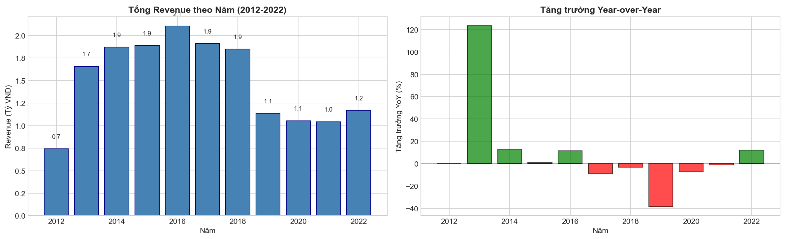
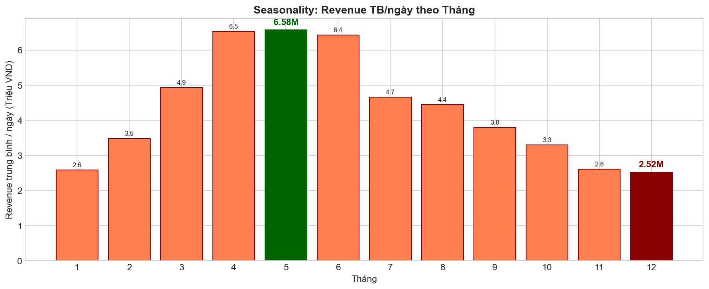
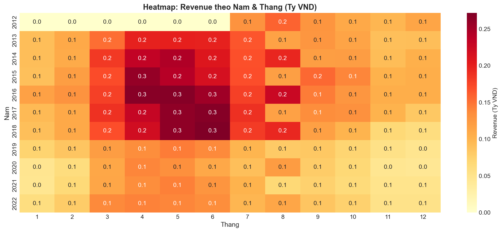
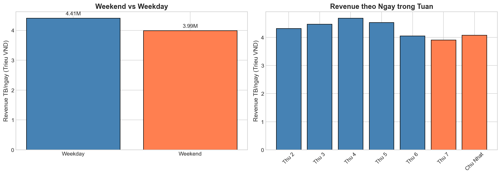

---

## 3. Cấp độ 2: DIAGNOSTIC — Chẩn đoán

> **Câu hỏi**: Tại sao doanh thu tăng/giảm? Nguyên nhân là gì?

### 3.1 Revenue Drivers Framework

```
Revenue = Orders × AOV
Orders = Sessions × Conversion Rate
=> Revenue = Sessions × Conversion × AOV
```

### 3.2 So sánh Drivers theo Quý

| Driver | Q2 (Cao) | Q4 (Thấp) | %Diff | Finding |
|--------|-----------|-----------|-------|---------|
| **Revenue** | 197.5M | 86.3M | +129% | Q4 đạt 43% của Q2 |
| **Orders** | 7,352 | 3,843 | +91% | Main driver |
| **AOV** | 27,860 | 24,270 | +15% | Minor driver |
| **Sessions** | 1,089K | 517K | +111% | Major driver |
| **Conversion** | 0.72% | 0.78% | -8% | Q4 cao hơn Q2! |

### 3.3 Phân tích Q2 (Tháng 4-6)

**Evidence**:
- Sessions tăng +111% so với Q4
- Orders tăng +91%
- AOV chỉ tăng +15%
- Conversion Q2 (0.72%) thấp hơn Q4 (0.78%)

**Interpretation**:
> Q2 mạnh có liên hệ chủ yếu với **nhiều người truy cập hơn** (traffic). Tuy nhiên, **chưa thể loại trừ supply constraint** nếu thiếu stockout, fulfillment, cancellation data.

### 3.4 Phân tích Q4 (Tháng 10-12)

**Evidence**:
- Sessions giảm -47% so với Q2
- **Conversion Q4 (0.78%) cao hơn Q2 (0.72%)**

**Interpretation**:
> Q4 thấp có liên hệ chủ yếu với **sessions/traffic thấp**, không phải conversion thấp. Conversion cao hơn gợi ý những người đến có intent mua cao, nhưng ít người đến hơn.

> ⚠️ **Chưa đủ dữ liệu để kết luận root cause**. Q4 thấp có thể liên quan đến acquisition/visibility, nhưng chưa có marketing spend data, competitor data, hoặc stockout data để xác nhận.

### 3.5 Phân tích AOV

**Evidence**:
- AOV difference giữa Q2 và Q4 chỉ +15%
- AOV index std across months = 11% (low variability)

**Interpretation**:
> AOV không phải là driver chính cho seasonality.

### 3.6 Driver Correlation Matrix

|  | Revenue | Orders | AOV | Sessions | Conversion |
|--|---------|--------|-----|----------|------------|
| **Revenue** | 1.00 | 0.93 | -0.09 | 0.46 | 0.44 |
| **Orders** | 0.93 | 1.00 | -0.44 | 0.28 | 0.66 |
| **AOV** | -0.09 | -0.44 | 1.00 | 0.34 | -0.71 |
| **Sessions** | 0.46 | 0.28 | 0.34 | 1.00 | -0.44 |
| **Conversion** | 0.44 | 0.66 | -0.71 | -0.44 | 1.00 |

**Key Correlations**:
- Revenue strongly correlated with Orders (r = 0.93)
- Orders correlated with Conversion (r = 0.66)
- AOV negatively correlated with Conversion (r = -0.71)

### 3.7 Charts — Diagnostic

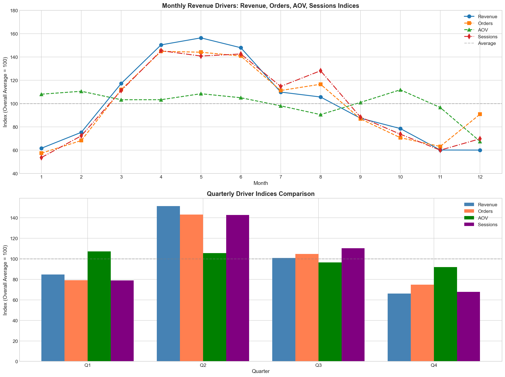
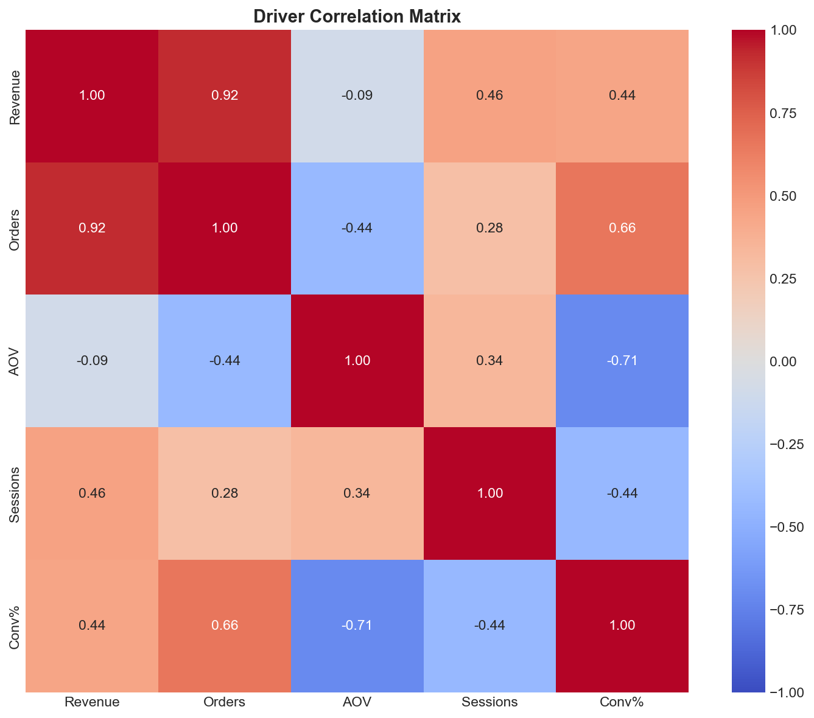
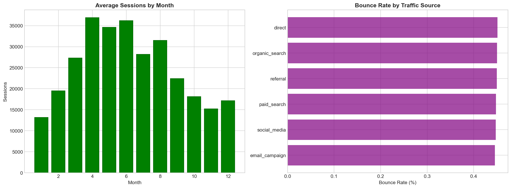

---

## 4. Cấp độ 3: PREDICTIVE — Dự đoán

> **Câu hỏi**: Xu hướng nào sẽ lặp lại? Pattern nào đáng tin cậy?

### 4.1 Seasonality Stability

#### Monthly Index Statistics

| Tháng | Avg Index | Std | CV% | Min | Max | Avg Rank | Độ tin cậy |
|-------|-----------|-----|-----|-----|-----|----------|-------------|
| 1 | 61.6% | 17.6 | 28.5% | 36% | 90% | 10.6 | Thấp |
| 2 | 75.3% | 17.8 | 23.7% | 48% | 99% | 8.2 | Trung bình |
| 3 | 117.2% | 22.9 | 19.5% | 86% | 144% | 4.6 | Trung bình |
| **4** | **150.3%** | 41.0 | 27.3% | 103% | 205% | 2.0 | Thấp |
| **5** | **156.3%** | 44.7 | 28.6% | 102% | 206% | 1.5 | Thấp |
| **6** | **147.9%** | 46.8 | 31.6% | 85% | 208% | 2.8 | Thấp |
| 7 | 109.8% | 30.2 | 27.5% | 70% | 145% | 4.8 | Thấp |
| 8 | 105.6% | 38.3 | 36.3% | 52% | 174% | 5.5 | Thấp |
| 9 | 87.4% | 21.8 | 24.9% | 57% | 119% | 6.4 | Trung bình |
| 10 | 78.5% | 21.1 | 26.9% | 50% | 107% | 8.0 | Thấp |
| 11 | 60.1% | 18.4 | 30.6% | 35% | 81% | 10.6 | Thấp |
| 12 | 60.0% | 21.0 | 34.9% | 33% | 88% | 10.5 | Thấp |

#### Định nghĩa Độ tin cậy

- **Cao**: CV < 20% (stable pattern)
- **Trung bình**: CV 20-25%
- **Thấp**: CV > 25% (high variability)

### 4.2 Direction của Seasonality đáng tin hơn Magnitude

**Evidence**:
- Q2 > Q4 vẫn đúng qua tất cả các năm (2013-2022)
- Tháng 11-12 luôn thấp hơn tháng 4-6
- Tuy nhiên, **magnitude đang giảm dần**

**Monthly Revenue Index by Year**:

| Tháng | 2013 | 2014 | 2015 | 2016 | 2017 | 2018 | 2019 | 2020 | 2021 | 2022 | Trend |
|-------|------|------|------|------|------|------|------|------|------|------|-------|
| **4** | 153% | 178% | 199% | 205% | 176% | 169% | 104% | 107% | 103% | 108% | ↓ |
| **5** | 154% | 187% | 184% | 206% | 202% | 202% | 111% | 102% | 110% | 107% | ↓ |
| **6** | 152% | 160% | 166% | 195% | 205% | 208% | 106% | 85% | 99% | 104% | ↓ |
| 11 | 69% | 72% | 78% | 81% | 77% | 52% | 42% | 35% | 39% | 40% | ↓ |
| 12 | 70% | 80% | 81% | 81% | 64% | 47% | 37% | 33% | 39% | 40% | ↓ |

**Key Finding**:
- T4-T6 (2015-2018): 200%+
- T4-T6 (2019-2022): 100-110%
- Peak months có **high variability** (CV = 27-32%)
- Low months (Q4) **ổn định hơn** peak months

> ⚠️ **Không nên planning quá mạnh chỉ dựa trên historical peak**. Mức uplift của Q2 biến động cao và có xu hướng giảm gần đây.

### 4.3 Predictive Reliability Assessment

| Pattern | Độ tin cậy | Evidence |
|---------|-------------|----------|
| Q2 thường cao hơn Q4 | **Cao** | Consistent, nhưng magnitude biến đổi |
| Q4 thường thấp | **Cao** | Consistent, stable |
| T1-T2 thường thấp | **Cao** | Consistent |
| Specific month peak cụ thể | **Thấp** | Too variable |
| Rank order của các tháng | **Trung bình** | Q2 > Q3 > Q1 > Q4 consistently |

### 4.4 Traffic-Revenue Lag Analysis

#### Lag Correlation Results

| Lag (days) | Correlation | Interpretation |
|------------|-------------|----------------|
| 0 (cùng ngày) | **0.321** | Trung bình |
| 1 | **0.322** | Trung bình (best) |
| 3 | 0.312 | Trung bình |
| 7 | 0.309 | Trung bình |
| 14 | 0.288 | Yếu-Trung bình |
| 30 | 0.213 | Yếu |

#### Key Findings

**Evidence**:
- Best correlation at lag 1 day: r = 0.322
- Chỉ giải thích ~10% variance (r² = 0.10)
- Correlation tương tự tại lag 0, 1, 3, 7 days

**Interpretation**:
> Traffic có liên hệ với revenue, nhưng **không đủ mạnh để dùng như tín hiệu dự báo độc lập**. Nhiều factors khác ảnh hưởng đến revenue ngoài traffic.

### 4.5 Charts — Predictive

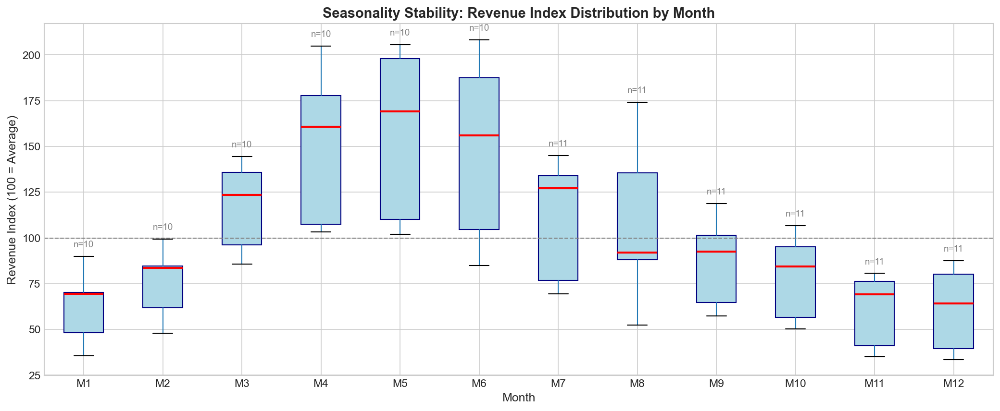
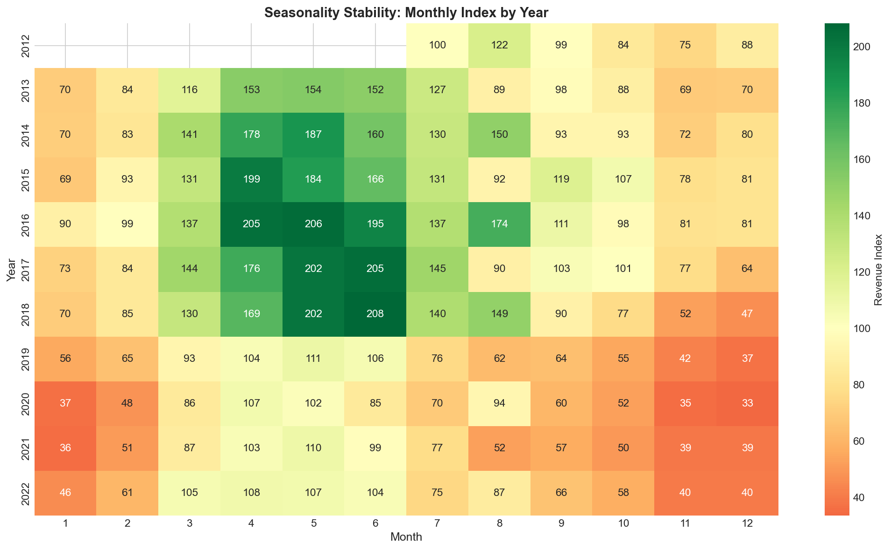
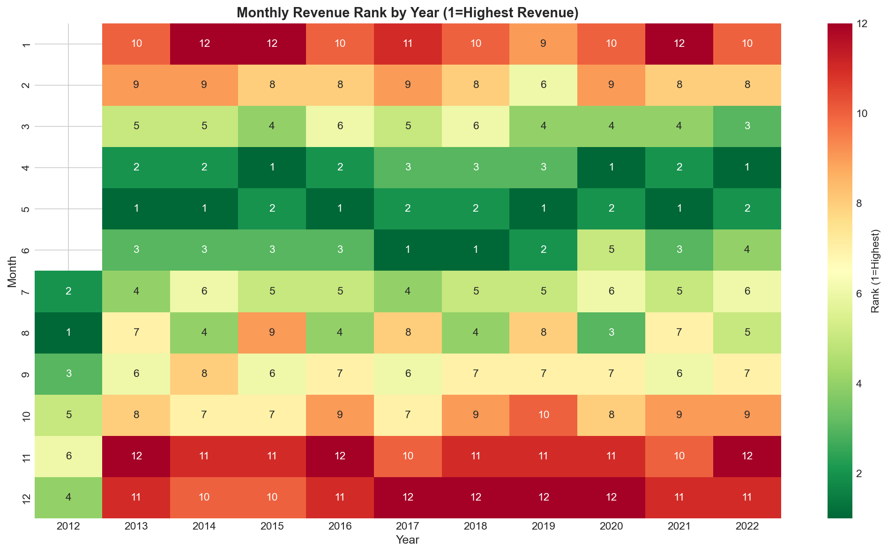
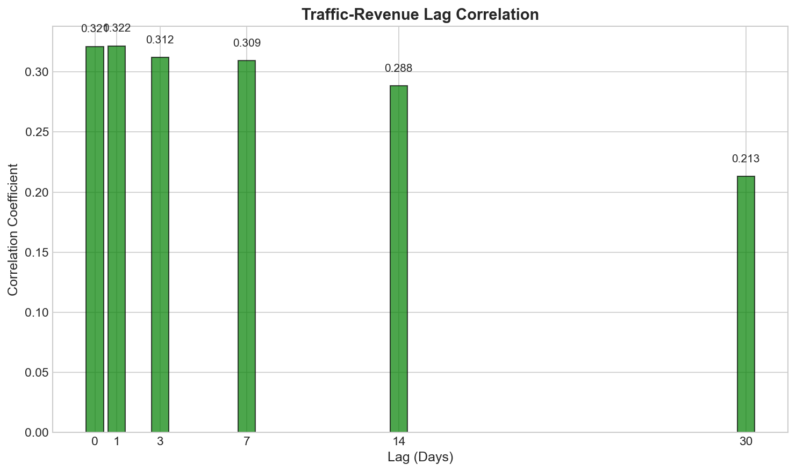
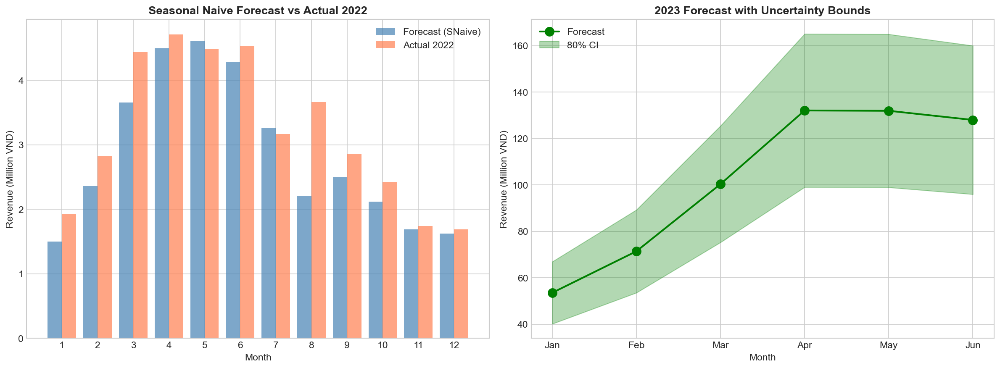

---

## 5. Cấp độ 4: PRESCRIPTIVE — Đề xuất

> **Câu hỏi**: Cần làm gì để cải thiện doanh thu?

### 5.1 Recommendations Summary

| # | Category | Recommendation | Độ tin cậy |
|---|---------|----------------|-------------|
| 1 | Q2 Planning | Chuẩn bị inventory/capacity cho Q2 | Cao |
| 2 | Q2 Planning | Không over-scale theo peak cũ | Trung bình |
| 3 | Q4 Investigation | Điều tra traffic drop trước khi hành động lớn | Cao |
| 4 | Q4 Investigation | Test: marketing vs organic traffic? | Trung bình |
| 5 | Tet Period | Kiểm tra fulfillment capacity | Cao |
| 6 | Tet Period | Không tăng marketing mù | Cao |
| 7 | Traffic | Dùng như monitoring signal cùng Orders, Conversion, AOV | Thấp |
| 8 | Weekend | Ưu tiên thấp nếu effect nhỏ | Thấp |

### 5.2 Detailed Recommendations

#### Recommendation 1: Chuẩn bị Q2

| Component | Detail |
|-----------|--------|
| **Recommendation** | Chuẩn bị inventory và capacity cho Q2 (T4-T6) |
| **Evidence** | Q2 consistently cao, sessions +111% so với Q4 |
| **Độ tin cậy** | Cao cho direction Q2 cao hơn |
| **Rủi ro** | Trung bình - Peaks gần đây có xu hướng thấp hơn |
| **Hành động** | Build stock 1-2 tháng trước Q2 |
| **Owner** | Ops + Merchandising |
| **Validation** | Track stockout rate hàng tuần trong Q2 |

#### Recommendation 2: Không Over-scale cho Q2

| Component | Detail |
|-----------|--------|
| **Recommendation** | Không over-scale theo peak cũ (200%+) |
| **Evidence** | Peak months gần đây chỉ đạt 100-110%, không phải 200%+ |
| **Độ tin cậy** | Trung bình |
| **Rủi ro** | Over-investment nếu peak không đạt kỳ vọng |
| **Hành động** | Plan với conservative estimate (e.g., 120-130% thay vì 200%) |
| **Owner** | Ops + Finance |
| **Validation** | Compare actual vs forecast quarterly |

#### Recommendation 3: Điều tra Q4 Root Cause

| Component | Detail |
|-----------|--------|
| **Recommendation** | Điều tra TẠI SAO traffic drop ở Q4 trước khi hành động lớn |
| **Evidence** | Q4 sessions -47%, nhưng conversion +8% so với Q2 |
| **Độ tin cậy** | Cao cho problem, Thấp cho cause |
| **Rủi ro** | Action sai có thể lãng phí budget |
| **Hành động** | 1. Survey/exit interviews Q4 visitors |
| | 2. Phân tích competitor activity Q4 |
| | 3. Kiểm tra marketing spend Q4 |
| **Owner** | Analytics + Marketing |
| **Validation** | Xác định root cause trước, sau đó test solution |

#### Recommendation 4: Kiểm tra Tet Fulfillment

| Component | Detail |
|-----------|--------|
| **Recommendation** | Kiểm tra order completion rate trong Tet trước khi tăng marketing |
| **Evidence** | T1-T2 consistently thấp (61-75%) |
| **Độ tin cậy** | Cao cho problem |
| **Rủi ro** | Logistics bottleneck có thể tệ hơn với nhiều orders hơn |
| **Hành động** | 1. Phân tích order completion rate by date |
| | 2. So sánh fulfillment time T1-T2 vs other months |
| **Owner** | Ops + Analytics |
| **Validation** | Nếu completion < 90%, fulfillment là vấn đề |

#### Recommendation 5: Traffic Monitoring (Thận trọng)

| Component | Detail |
|-----------|--------|
| **Recommendation** | Dùng traffic như một trong nhiều signals, không phải tín hiệu độc lập |
| **Evidence** | r = 0.32 (yếu-trung bình) |
| **Độ tin cậy** | Thấp |
| **Rủi ro** | Có thể cho tín hiệu sai |
| **Hành động** | Monitor hàng ngày, không phản ứng với single-day drops |
| **Owner** | Analytics |
| **Validation** | Track accuracy over time |

### 5.3 Các kết luận/hành động cần tránh

| Tránh | Lý do |
|-------|-------|
| "Q4 thấp vì khách hàng chi tiêu cho Tết" | **Chưa đủ bằng chứng** |
| "Tăng marketing 50% cho Q2" | **Chưa đủ bằng chứng** - Không có ROI data |
| "Traffic dự báo revenue" | **Overclaimed** - r = 0.32 chỉ là yếu-trung bình |
| "Q2 chắc chắn peak ở 200%" | **Chưa đủ bằng chứng** - Peak đang giảm |
| "Marketing Tet sẽ boost sales" | **Rủi ro** - Có thể làm nặng fulfillment hơn |
| "Supply is not the bottleneck" | **Chưa đủ bằng chứng** - Thiếu stockout/fulfillment data |

---

## 6. Tổng kết & Khuyến nghị

### 6.1 Key Takeaways

1. **Q2 > Q4 là pattern đáng tin theo direction**
   - Q2 thường cao hơn Q4 qua tất cả các năm
   - Tuy nhiên, magnitude không ổn định và đang giảm

2. **Magnitude của seasonality không ổn định**
   - CV = 25-35% cho hầu hết tháng
   - Peak months có thể dao động từ 85% đến 206%

3. **Traffic/sessions là driver quan sát được quan trọng nhất**
   - Q2 mạnh chủ yếu do traffic cao hơn
   - Q4 thấp chủ yếu do traffic thấp hơn

4. **Q4 thấp không phải do conversion thấp**
   - Conversion Q4 (0.78%) cao hơn Q2 (0.72%)
   - Gợi ý intent có sẵn, nhưng ít người đến

5. **Không nên overclaim causality**
   - Correlation ≠ Causation
   - Chưa đủ data để kết luận root cause

### 6.2 Priority Actions

| Priority | Action | Owner |
|----------|--------|-------|
| **Cao** | Chuẩn bị inventory Q2 (conservative) | Ops |
| **Cao** | Điều tra Q4 traffic drop | Analytics + Marketing |
| **Cao** | Kiểm tra Tet fulfillment | Ops + Analytics |
| **Trung bình** | Survey Q4 visitors | Marketing |
| **Trung bình** | Test Q4 marketing | Marketing |
| **Thấp** | Weekend optimization | Marketing |

### 6.3 Limitations

| Limitation | Impact |
|------------|--------|
| Traffic có thể phản ánh marketing activity | Không tách được organic vs paid |
| Conversion rate = orders/sessions | Chỉ là proxy, không phải true funnel |
| Không có marketing spend data | Không đánh giá được marketing ROI |
| Revenue mismatch 4.6% | Data quality issue |
| Không có stockout/fulfillment data | Chưa loại trừ supply constraint |
| Không có causal analysis | Chỉ quan sát được correlations |

---

## 7. Phụ lục

### A. Files đã tạo

```
reports/
├── BAO_CAO_CHU_DE1.md                    # Báo cáo này
├── figures/BAO_CAO_CHU_DE1/
│   ├── revenue_analysis_v3.py            # Script phân tích
│   │
│   ├── Charts - Descriptive:
│   │   ├── revenue_by_year.png
│   │   ├── revenue_by_month.png
│   │   ├── revenue_heatmap.png
│   │   └── weekday_analysis.png
│   │
│   ├── Charts - Diagnostic:
│   │   ├── monthly_revenue_drivers.png
│   │   ├── revenue_driver_indices.png
│   │   ├── driver_contribution.png
│   │   └── traffic_analysis.png
│   │
│   ├── Charts - Predictive:
│   │   ├── monthly_seasonality_boxplot.png
│   │   ├── seasonality_stability_heatmap.png
│   │   ├── monthly_rank_by_year.png
│   │   ├── traffic_revenue_lag_correlation.png
│   │   └── forecast_with_uncertainty.png
│   │
│   └── Charts - Summary:
│       ├── summary_dashboard.png
│       ├── gross_margin_analysis.png
│       └── promotion_analysis.png
```

### B. Methodology

1. **Data Preparation**: Load và clean sales, orders, web_traffic data
2. **Feature Engineering**: Tạo time features (year, month, quarter, day_of_week)
3. **Revenue Decomposition**: Revenue = Sessions × Conversion × AOV
4. **Seasonality Analysis**: Tính index theo tháng, CV, rank stability
5. **Lag Analysis**: Cross-correlation giữa traffic và revenue
6. **Statistical Tests**: t-test cho weekday/weekend

### C. Data Limitations

| Data | Why Needed |
|------|-----------|
| Marketing spend, channel mix | Tách organic vs paid traffic |
| Stockout/fulfillment/cancellation data | Loại trừ supply constraints |
| User-level journey | Track conversion funnel thực sự |
| Competitor data | Đánh giá market share |
| A/B test results | Đánh giá intervention effectiveness |

### D. Statistical Notes

| Test | Result | Interpretation |
|------|--------|----------------|
| Revenue-Orders correlation | r = 0.93 | Rất mạnh |
| Revenue-Sessions correlation | r = 0.46 | Trung bình |
| Revenue-Conversion correlation | r = 0.44 | Trung bình |
| Traffic-Revenue best lag | r = 0.32 | Yếu-Trung bình |
| Weekday vs Weekend | p = 0.00001 | Significant, nhưng effect size nhỏ |
| Monthly CV | 25-35% | High variability |

---

**Báo cáo được tạo bởi Senior Data Analyst**
**Ngày cập nhật**: 27/04/2026
**Version**: FINAL
