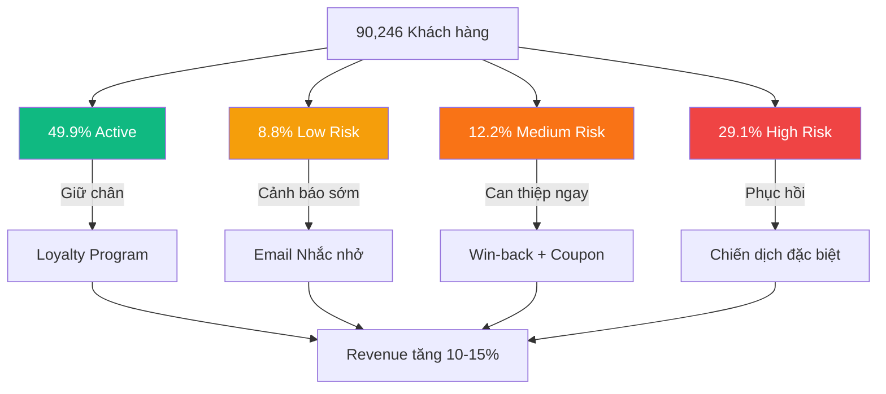

# 📊 Story 2: Customer Segmentation & Lifetime Value

## Câu hỏi kinh doanh cốt lõi

> *Khách hàng nào có giá trị cao nhất? Kênh nào mang khách chất lượng? Ai có nguy cơ rời bỏ?*

**Dữ liệu sử dụng:** `customers.csv` × `orders.csv` × `order_items.csv` × `products.csv` × `geography.csv`

**Quy mô phân tích:** 90,246 khách hàng | 646,945 đơn hàng | 714,669 dòng order_items

---

## 1. Tổng quan khách hàng (Customer-Level Dataset)

Trước khi phân tích, dữ liệu được aggregate ở **cấp khách hàng** — mỗi dòng = 1 khách hàng:

| Metric | Mean | Median | Min | Max |
|--------|------|--------|-----|-----|
| Số đơn hàng | 7.2 | 4 | 1 | 107 |
| Tổng revenue | 173,757 VND | 89,906 VND | 439 VND | 3,503,583 VND |
| AOV (giá trị TB/đơn) | 24,046 VND | 22,259 VND | 439 VND | 202,023 VND |
| Tenure (ngày hoạt động) | 1,762 ngày | 1,931 ngày | 0 | 3,829 ngày |

> [!NOTE]
> **AOV (Average Order Value)** = Tổng doanh thu ÷ Tổng số đơn hàng. Con số ~24K VND cho thấy mỗi lần mua, khách hàng chi trung bình 24 nghìn đồng.

---

## 2. Phân tích chi tiết qua 5 biểu đồ

### 📊 2.1 — Revenue by Age Group × Gender (Descriptive)

**Mục đích:** Xác định nhóm khách hàng nào đóng góp doanh thu nhiều nhất.

**Phát hiện:**

| Age Group | Revenue Share | Đặc điểm |
|-----------|--------------|-----------|
| **25-34** | **29.5%** | Nhóm lớn nhất — 36,342 khách hàng, chi tiêu ~4.7B VND |
| **35-44** | **26.3%** | Nhóm thứ hai — 31,920 KH, sức mua ổn định |
| **45-54** | **19.3%** | Nhóm trung niên — ít KH hơn nhưng AOV tương đương |
| **55+** | **13.7%** | Nhóm nhỏ nhất (13,457 KH) nhưng trung thành nhất (5.41 đơn/KH) |
| **18-24** | **11.2%** | Nhóm trẻ — tiềm năng tương lai nhưng sức mua hiện tại thấp |

- **Giới tính** phân bổ đều: Female (~49%) ≈ Male (~47%), Non-binary (~4%)
- Không có sự khác biệt đáng kể về chi tiêu giữa nam và nữ trong cùng age group

> [!IMPORTANT]
> **Insight kinh doanh:** Nhóm 25-44 tuổi chiếm **55.8% tổng revenue** — đây là nhóm core cần được ưu tiên trong mọi chiến dịch marketing.

---

### 📊 2.2 — Acquisition Channel Effectiveness (Diagnostic)

**Mục đích:** Xác định kênh nào mang lại khách hàng **chất lượng** nhất (không chỉ số lượng).

**Phát hiện:**

| Kênh | Volume (KH) | Avg Revenue/KH | Avg Orders/KH |
|------|-------------|-----------------|----------------|
| organic_search | **26,900** | 175K | 7.2 |
| social_media | 18,000 | 175K | 7.2 |
| paid_search | 18,000 | 173K | 7.2 |
| email_campaign | 10,900 | 172K | 7.1 |
| referral | 9,100 | 172K | 7.1 |
| direct | 7,300 | 170K | 7.1 |

- **Chất lượng khách hàng gần như đồng đều** giữa 6 kênh (chênh lệch chỉ ~3%)
- Sự khác biệt chính nằm ở **volume**: organic_search mang 26.9K KH, gấp 3.7× direct

> [!IMPORTANT]
> **Insight kinh doanh:** Không có kênh nào mang khách "xịn" hơn hẳn. Chiến lược tối ưu = **tối đa hoá volume** ở kênh có chi phí/khách (CPA) thấp nhất, thay vì tìm kênh "chất lượng cao" hơn.

---

### 📊 2.3 — Customer Cohort Analysis (Diagnostic)

**Mục đích:** Theo dõi chất lượng khách hàng mới qua các năm. Cohort nào engagement tốt nhất?

**Phát hiện:**

- **Khách hàng mới tăng đều**: từ 674 (2012) → 15,652 (2022) — growth rate ~30%/năm
- **Avg Orders phẳng**: ~7.1-7.3 đơn/KH qua mọi cohort → không có "cohort vàng"
- **AOV ổn định**: ~24K VND — pricing strategy nhất quán nhưng **không có dấu hiệu upsell**
- **Avg Lifetime Revenue**: ~170-178K VND — khách mới và cũ chi tiêu gần bằng nhau

> [!WARNING]
> **Vấn đề nghiêm trọng:** AOV phẳng ~24K qua **10 năm** cho thấy công ty chưa có chiến lược upsell/cross-sell hiệu quả. Khách hàng trung thành vẫn chi tiêu giống như lần đầu mua — đây là cơ hội bị bỏ lỡ lớn.

---

### 📊 2.4 — Churn Risk Analysis (Predictive)

**Mục đích:** Dự đoán khách hàng nào có nguy cơ rời bỏ dựa trên hành vi mua hàng.

**Phương pháp:** So sánh **recency** (bao lâu rồi chưa mua) với **avg inter-order gap** (khoảng cách TB giữa các lần mua) của từng khách:

| Churn Tier | Điều kiện | Số KH | % | Revenue at Risk |
|------------|-----------|-------|---|-----------------|
| ✅ Active | Recency < 1.5× gap | 33,853 | **49.9%** | 8.04B VND |
| 🟡 Low Risk | 1.5-2× gap | 5,994 | 8.8% | 1.46B VND |
| 🟠 Medium Risk | 2-3× gap | 8,271 | **12.2%** | 1.90B VND |
| 🔴 High Risk | > 3× gap | 19,770 | **29.1%** | 3.74B VND |

**Ví dụ cụ thể:**
- Khách A mua mỗi 60 ngày → nếu 180 ngày chưa quay lại (3× gap) → **High Risk**
- Khách B mua mỗi 200 ngày → nếu 400 ngày chưa mua (2× gap) → **Medium Risk**

> [!CAUTION]
> **Phát hiện nghiêm trọng:**
> - Chỉ **49.9%** khách repeat đang Active — gần **1/2 đã có dấu hiệu rời bỏ**
> - **5.64 tỷ VND** revenue at risk (Medium + High) — đây là số tiền sẽ mất vĩnh viễn nếu không can thiệp
> - Nhóm Low Risk (5,994 KH) sẽ trượt sang Medium/High trong 3-6 tháng nếu không hành động

---

### 📊 2.5 — Geographic Revenue Distribution (Prescriptive)

**Mục đích:** Phân tích phân bổ doanh thu theo vùng miền và thành phố.

**Phát hiện:**

| Vùng | Revenue | % Share | Số KH |
|------|---------|---------|-------|
| **East** | **7.3B VND** | **46.5%** | Lớn nhất |
| Central | 4.7B VND | 30.1% | Trung bình |
| West | 3.7B VND | 23.4% | Nhỏ nhất |

- Top 10 thành phố doanh thu cao nhất **đều thuộc vùng East** (Sơn Tây, Nam Định, Thái Nguyên, Phú Lý, Hà Nội...)
- Revenue/customer ở các vùng **tương đương nhau** → khi mở rộng sang Central/West, mỗi KH mới vẫn mang lại doanh thu tương tự

> [!IMPORTANT]
> **Rủi ro tập trung:** Gần nửa revenue phụ thuộc vào 1 vùng địa lý. Bất kỳ biến động nào ở East (cạnh tranh, suy thoái cục bộ) sẽ ảnh hưởng nghiêm trọng đến tổng doanh thu.

---

## 3. Phân tích 4 cấp độ tổng hợp

### 🔵 DESCRIPTIVE — Chuyện gì đang xảy ra?

| Chỉ số | Giá trị | Nhận xét |
|--------|---------|----------|
| Tổng KH | 90,246 | Cơ sở khách hàng lớn |
| TB đơn/KH | 7.2 | Repeat rate tốt |
| AOV | ~24,000 VND | Giá trị đơn hàng trung bình |
| Nhóm core | 25-44 tuổi | Chiếm 55.8% revenue |
| Vùng chủ lực | East | 46.5% tổng doanh thu |
| Kênh chính | organic_search | 26.9K KH (nhiều nhất) |

### 🟡 DIAGNOSTIC — Tại sao?

1. **Revenue tập trung vào East** vì top 10 thành phố lớn nhất đều nằm ở đây → chiến lược marketing ban đầu ưu tiên vùng này
2. **Acquisition channels đồng đều về chất lượng** → sản phẩm và dịch vụ nhất quán bất kể kênh thu hút, cần tối ưu volume thay vì chất lượng kênh
3. **AOV phẳng 10 năm** → không có chương trình upsell/cross-sell hiệu quả, đề xuất sản phẩm chưa cá nhân hoá
4. **Cohort analysis phẳng** → chất lượng KH mới không giảm (tốt) nhưng cũng không tăng (cơ hội bỏ lỡ)

### 🟠 PREDICTIVE — Điều gì sẽ xảy ra tiếp?

1. **29.1%** khách repeat (19,770 người) đang **High Risk churn** → 3.74B VND sẽ mất
2. Tổng revenue at risk = **5.64B VND** (Medium + High) ≈ **36% revenue từ repeat customers**
3. Nhóm Low Risk (5,994 KH) sẽ chuyển sang Medium/High trong **3-6 tháng** nếu không can thiệp
4. Với growth rate KH mới ~15K/năm vs churn ~20K/năm, **tổng KH active sẽ giảm net**

### 🔴 PRESCRIPTIVE — Nên làm gì?

| # | Hành động | Đối tượng | Kết quả kỳ vọng |
|---|-----------|-----------|-----------------|
| 1 | **Win-back campaign khẩn cấp** | 8,271 KH Medium Risk | Cứu lại ~1.90B VND, giảm tỷ lệ chuyển sang High Risk 50% |
| 2 | **Loyalty program (Silver/Gold/Platinum)** | 60,000+ KH nhóm 25-44 | Tăng retention rate 15-20%, AOV tăng 10% |
| 3 | **Bundle offers & product recommendations** | Toàn bộ KH | Phá vỡ AOV phẳng 24K → target 28-30K (+17-25%) |
| 4 | **Mở rộng Central/West** | KH tiềm năng vùng mới | Tăng revenue share từ 53.5% → 60%, giảm rủi ro tập trung |
| 5 | **Onboarding email series cho KH mới** | Cohort 2022+ (15.6K KH/năm) | Tăng 2nd purchase rate từ ~75% lên 85% |
| 6 | **Referral program** | KH Active hiện tại | Giảm CPA, tăng volume ở kênh có chất lượng tương đương |

> [!TIP]
> **Ưu tiên cao nhất:** Hành động #1 (Win-back) vì chi phí thấp (chỉ cần email/SMS + coupon) nhưng potential revenue recovery = **1.90B VND**. ROI ước tính: 10-20× chi phí chiến dịch.

---

## 4. Tóm tắt & Kết luận

**3 hành động quan trọng nhất:**

1. 🚨 **Ngay lập tức:** Win-back 8,271 KH Medium Risk (5.64B VND at risk)
2. 📈 **Ngắn hạn:** Triển khai upsell/cross-sell để phá vỡ AOV phẳng 24K
3. 🌍 **Trung hạn:** Mở rộng Central/West để giảm phụ thuộc vào East (46.5%)
